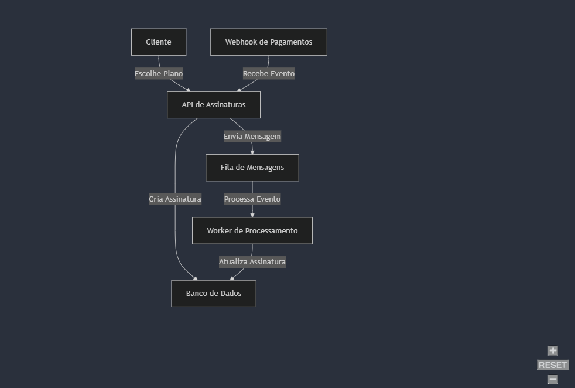

# 📌 Controle de Assinaturas - API SaaS

## 🚀 Sobre o Projeto
### Este projeto consiste em uma API para gerenciamento de assinaturas de um sistema SaaS ou serviço de streaming. Ele utiliza Spring Boot, PostgreSQL e Kafka para lidar com o ciclo de vida das assinaturas, incluindo criação, cobrança recorrente, upgrades/downgrades e cancelamentos, A API é orientada a eventos e utiliza uma fila de mensagens para processar atualizações de cobrança e status das assinaturas de forma assíncrona.

## 🎯 Objetivo do Projeto
### uma API para gerenciar assinaturas e planos.
### Implementar filas de mensagens (Kafka) para processamento assíncrono de eventos.
### Atualizar assinaturas automaticamente com base nos eventos processados.
### Fornecer métricas básicas sobre assinaturas e planos.

## ⚙️ Tecnologias Utilizadas
### Java 23 + Spring Boot (Backend da API)
### PostgreSQL (Banco de dados relacional)
### Kafka (Mensageria para eventos assíncronos)
### Docker (Para rodar o Kafka)
### Spring Data JPA (Persistência de dados)

## 🏛 Arquitetura do Sistema
### 🔄 Fluxo de Assinatura

### O usuário cria uma nova assinatura através do endpoint POST /subscriptions/register.
### A API armazena a assinatura no PostgreSQL e publica um evento subscription_created no Kafka.
### O worker consome o evento e processa a cobrança.
### Após o pagamento, um evento payment_success é publicado no Kafka.
### O worker atualiza o status da assinatura no banco de dados.

## 📨 Mensageria (Kafka)
### Os eventos são processados de forma assíncrona, garantindo maior escalabilidade.
## Eventos suportados:
### subscription_created → Nova assinatura criada.
### payment_success → Pagamento confirmado.
### payment_failed → Pagamento recusado.

